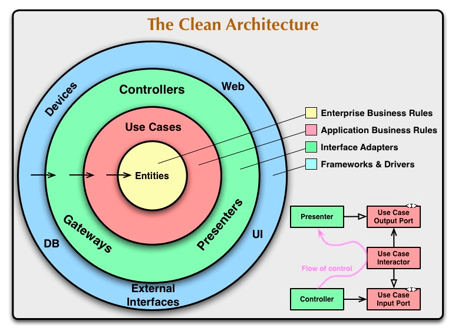

# 01 はじめに

## クリーンアーキテクチャ学習の始まり

## 🧩 はじめに

このカリキュラムへようこそ！
ここでは、「**クリーンアーキテクチャ**」という、変化に強く、テストが容易で、長くメンテナンスし続けられるソフトウェアを設計するための、非常に強力な考え方を学びます。

難しそうに聞こえるかもしれませんが、心配はいりません。
このカリキュラムでは、複雑な理論から入るのではなく、実際に手を動かしてシンプルなアプリケーションを何度も構築する**実践的なアプローチ**を取ります。

---

## 🧩 SOLID原則でつまずいた経験のある方へ

オブジェクト指向設計を学ぼうとして、「SOLID原則」のような抽象的な概念に出会い、難しさを感じた経験はありませんか？

もしそうであっても、全く心配はいりません。

このカリキュラムは、まさにそういった方々にこそ最適な学習法です。クリーンアーキテクチャという具体的な「設計図」に沿ってコードを書いていくことで、

- なぜ**インターフェース**が必要なのか？ (インターフェース分離の原則)
- なぜ具体的なクラスではなく**抽象**に依存するのか？ (依存性反転の原則)
- なぜ**振る舞いを変更**しても、既存のコードを**修正しなくて済む**のか？ (オープン・クローズドの原則)

といったSOLID原則の**本質的な「なぜ」を、理屈ではなく実践を通して体感**できます。

理論から入るのではなく、まず手を動かして「クリーンな構造」を作ってみる。その経験を通じて、SOLID原則が目指していた美しい設計が、自然と腑に落ちるはずです。

---

## 🧩 2つの「地図」

これから私たちは、設計の旅を進める上で、2つの「地図」を目にすることになります。

**1. 同心円の図**

**2. フローのクラス図**

現時点で、これらの図が何を意図しているのかを完全に理解する必要は全くありません。「何やらルールや役割分担がありそうだ」と感じていただければ十分です。

---

## このカリキュ-ラムの進め方：設計図をなぞるように

このカリキュラムの最大の特徴は、ただ図を眺めるだけでなく、2つ目の「フローのクラス図」を明確な「型」や「設計図」として利用する点にあります。

私たちは、この設計図に描かれた一つ一つの箱（`Controller`, `UseCase`, `Presenter`など）を、順番にクラスとして実装していきます。

この「型にはめて学ぶ」アプローチには、以下のような大きな利点があります。

- **迷わない**:
「次に何を作ればいいんだろう？」と迷うことがありません。設計図が次に作るべき部品とその役割を明確に示してくれます。
- **責務に集中できる**:
全体の構造を一度に心配する必要がないため、「今作っている`Presenter`の役割は何か？」というように、各部品の*責務（役割）*を理解することに集中できます。
- **繰り返しによる習得**:
同じ「型」を使って異なる題材のアプリケーションを何度も作ることで、クリーンアーキテクチャの思考パターンが自然と身につきます。

---

## 🧩 魔法の言葉たち

学習を進めていく中で、以下のような、少し難解に聞こえる「魔法の言葉」に出会うかもしれません。

> - 抽象は詳細に依存してはならない
> - ビジネスルールは叫ぶ
> - データベースは詳細である
> - フレームワークは決定を遅らせるためのツールである
> 

これらの言葉も、今は呪文のように聞こえるかもしれませんが、設計図をなぞるようにアプリケーションを構築していくうちに、その**真の意味**が「ああ、なるほど！」と腑に落ちる瞬間が必ずやってきます。

---

## 🧩 さあ、始めよう！

理論は一旦脇に置いて、まずは最初の題材であるシンプルな「TODOアプリ」の構築を通して、クリーンアーキテクチャの世界に足を踏み入れてみましょう。

**百聞は一見に如かず、百見は一'build'に如かず**です。
一緒に、クリーンで美しいコードの世界を探求していきましょう！

## 🧩 参考

実践クリーンアーキテクチャ 音ズレ修正Ver.【プログラミング】
[https://www.youtube.com/watch?v=BvzjpAe3d4g](https://www.youtube.com/watch?v=BvzjpAe3d4g)

世界一わかりやすいClean Architecture #csharptokyo
[https://www.youtube.com/watch?v=pbCRHAM5NG0](https://www.youtube.com/watch?v=pbCRHAM5NG0)