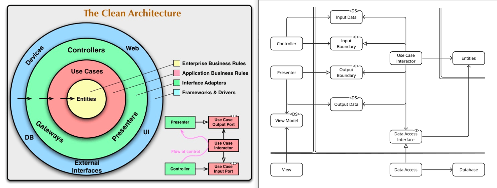

# 21 拡張：DB導入

# 🔩 DBの変更: MongoDBへの換装

この章では、クリーンアーキテクチャがもたらすもう一つの強力な利点を体験します。これまでインメモリの辞書で代用してきたデータ永続化の仕組みを、**NoSQLデータベースである MongoDB に差し替えます。**

ここで注目してほしいポイントはこれです👇

> データベースという大きな技術的決定を変えても、
> **ビジネスロジック（UseCase）やドメインルール（Entity）、さらにはUI層には一切手を加えない。**

データベースは交換可能な「詳細」に過ぎない、という事実を実感しましょう。



---

## 🎯 この章の目的

* データベースが「詳細」であり、プラグのように交換可能な部品であることを証明する。
* `DataAccessInterface`（Repositoryインターフェース）が、`UseCase`を具体的なデータ保存技術から隔離する“防波堤”として機能することを確認する。
* 依存性逆転の原則により、**ビジネスロジックがDBを知らない**／**DB側がビジネスの抽象に従う**という関係を、実際のコードで見る。

---

## 📁 フォルダ構成（MongoDB対応版）

図書館アプリとしての最終形イメージはこうなります👇
今回の差分は `infrastructure/` に新しいリポジトリ実装を追加することと、Composition Root（起動側）でそれを採用することだけです。

```text
clean_architecture_library/
├─ core/
│   ├─ domain/
│   │   ├─ book.py                          # Book, BookStatus
│   │   ├─ member.py                        # Member
│   │   ├─ loan.py                          # Loan
│   │   └─ repository.py                    # <I> 抽象リポジトリ (BookRepository など)
│   │
│   └─ usecase/
│       ├─ boundary/
│       │   ├─ dto.py                       # <DS> CheckOutBookInputData / OutputData / BookViewModel
│       │   ├─ input_boundary.py            # <I> CheckOutBookInputBoundary
│       │   └─ output_boundary.py           # <I> CheckOutBookOutputBoundary
│       │
│       └─ interactor/
│           └─ check_out_book.py            # 02 Use Case Interactor (CheckOutBookUseCase)
│
├─ interface_adapters/
│   ├─ data_access/
│   │   └─ in_memory_repositories.py        # 07 Data Access (インメモリ版)
│   │
│   ├─ presenters/
│   │   ├─ checkout_presenter.py            # 04 Presenter (コンソールUI用)
│   │   └─ django_presenter.py              # 20章で追加した Django Presenter
│   │
│   ├─ controllers/
│   │   └─ checkout_controller.py           # 05 Controller (コンソールUI用)
│   │
│   ├─ views/
│   │   ├─ view_console.py                  # 06 View (コンソールUI)
│   │   └─ django_views.py                  # 20章で追加した Django View(Controller兼任)
│   │
│   └─ templates/
│       └─ checkout.html                    # Djangoテンプレート
│
├─ infrastructure/
│   └─ repositories/
│       ├─ in_memory/                       # 既存: インメモリ実装
│       │   └─ (interface_adapters/data_access/in_memory_repositories.py を
│               プロジェクトによってはこちらへ移してもOK)
│       └─ mongo/                           # New✨ MongoDB実装群
│           └─ mongo_repositories.py        # MongoBookRepository / MongoMemberRepository / MongoLoanRepository
│
├─ main.py                                  # コンソール版のComposition Root
│                                           # (WebではDjango側がComposition Root)
└─ tests/
    └─ ...                                  # 12 テストまとめ
```

👆 今回「新しく生える」のは `infrastructure/repositories/mongo/mongo_repositories.py` です。
UI (`interface_adapters`) もユースケース (`core/usecase`) もドメイン (`core/domain`) も触りません。完璧。

---

## ✅ 変更・追加が必要なファイル

DBという「詳細」に直接関わるファイルだけが変更対象です。

* `infrastructure/repositories/mongo/mongo_repositories.py` (New✨)
  MongoDBとやりとりするためのRepository実装。
  `core/domain/repository.py` で定義されている抽象インターフェースを実装します。

* アプリのComposition Root

  * コンソールで動かすなら `main.py`
  * Djangoで動かすなら `interface_adapters/views/django_views.py`
    ここで、これまでのインメモリ版リポジトリを MongoDB版に差し替えるだけです。

---

## ❌ 変更が**不要**なファイル

これこそがクリーンアーキテクチャの核心です。
次の層は、一行も変更しません。

* **`core/domain/*.py`**

  * `book.py`, `member.py`, `loan.py`: 図書館のビジネスルールそのもの
  * `repository.py`: Repositoryインターフェース（抽象契約）
* **`core/usecase/interactor/check_out_book.py`**

  * 「本を貸し出す」というユースケースの実装
* **`core/usecase/boundary/*.py`**

  * InputBoundary, OutputBoundary, DTO（InputData / OutputData / ViewModel）
* **`interface_adapters/presenters/*`**

  * Console Presenter、Django PresenterなどUI層
* **`interface_adapters/views/*` / `templates/*`**

  * ConsoleView, DjangoView, HTMLテンプレート

つまり、**DBをMongoDBに変えても、UIもUseCaseもドメインモデルも一切いじらない。**
やるのは「外側の実装を差し替える」だけです。

---

## 💻 ソースコードの詳細解説

### 1. MongoDB用 Repository (Data Accessアダプター)

ここでは、`pymongo` を使ってMongoDBとやりとりするクラスを実装します。
このクラスたちは、`core/domain/repository.py` に定義されたインターフェース（抽象）を実装します。

主な責務はここ👇

* `Entity`（`Book`, `Member`, `Loan`）とMongoDBドキュメント（辞書）を相互変換すること
  → つまり「翻訳者」
* UseCaseから呼ばれる `find_by_id` や `save` などを、MongoDBの具体的な命令にマッピングすること
  → UseCaseはMongoDBの存在を知らないままでOK

```python
# infrastructure/repositories/mongo/mongo_repositories.py

from typing import Optional
from pymongo import MongoClient

from core.domain.book import Book, BookStatus
from core.domain.member import Member
from core.domain.loan import Loan
from core.domain.repository import (
    BookRepository,
    MemberRepository,
    LoanRepository,
)

MONGO_CONNECTION_STRING = "mongodb://localhost:27017/"
DB_NAME = "library_db"


# -----------------------------------------------------------------------------
# MongoDB Repository (Book)
# - クラス図の位置: DataAccess
# - 同心円図の位置: infrastructure / repositories (外側の技術詳細)
# -----------------------------------------------------------------------------
class MongoBookRepository(BookRepository):
    """BookRepositoryインターフェースのMongoDB版実装"""

    def __init__(self):
        self.client = MongoClient(MONGO_CONNECTION_STRING)
        self.db = self.client[DB_NAME]
        self.collection = self.db["books"]

    def _to_entity(self, doc: Optional[dict]) -> Optional[Book]:
        """MongoDBのドキュメント(dict)をBook Entityに変換する"""
        if not doc:
            return None
        return Book(
            id=doc["_id"],
            title=doc["title"],
            author=doc["author"],
            status=BookStatus(doc["status"]),  # Enumを復元
        )

    def _to_document(self, book: Book) -> dict:
        """Book EntityをMongoDB用のドキュメント(dict)に変換する"""
        return {
            "_id": book.id,
            "title": book.title,
            "author": book.author,
            "status": book.status.value,  # Enumは文字列で保存
        }

    def find_by_id(self, book_id: int) -> Optional[Book]:
        doc = self.collection.find_one({"_id": book_id})
        return self._to_entity(doc)

    def save(self, book: Book) -> Book:
        doc = self._to_document(book)
        # upsert=True: 既存なら更新、なければ新規作成
        self.collection.update_one(
            {"_id": book.id},
            {"$set": doc},
            upsert=True,
        )
        return book


# -----------------------------------------------------------------------------
# MongoDB Repository (Member)
# -----------------------------------------------------------------------------
class MongoMemberRepository(MemberRepository):
    """MemberRepositoryインターフェースのMongoDB版実装"""

    def __init__(self):
        self.client = MongoClient(MONGO_CONNECTION_STRING)
        self.db = self.client[DB_NAME]
        self.collection = self.db["members"]

    def _to_entity(self, doc: Optional[dict]) -> Optional[Member]:
        if not doc:
            return None
        return Member(
            id=doc["_id"],
            name=doc["name"],
        )

    def find_by_id(self, member_id: int) -> Optional[Member]:
        doc = self.collection.find_one({"_id": member_id})
        return self._to_entity(doc)


# -----------------------------------------------------------------------------
# MongoDB Repository (Loan)
# -----------------------------------------------------------------------------
class MongoLoanRepository(LoanRepository):
    """LoanRepositoryインターフェースのMongoDB版実装"""

    def __init__(self):
        self.client = MongoClient(MONGO_CONNECTION_STRING)
        self.db = self.client[DB_NAME]
        self.collection = self.db["loans"]
        self._next_id_counter = self.db["counters"]  # シンプルなID採番用のコレクション

    def _generate_next_id(self) -> int:
        """
        簡易的な連番の発行。
        countersコレクションで { _id: "loan_id", seq: <number> } を管理する想定。
        """
        result = self._next_id_counter.find_one_and_update(
            {"_id": "loan_id"},
            {"$inc": {"seq": 1}},
            upsert=True,
            return_document=True,
        )
        return result["seq"]

    def _to_entity(self, doc: dict) -> Loan:
        return Loan(
            id=doc["_id"],
            book_id=doc["book_id"],
            member_id=doc["member_id"],
            loan_date=doc["loan_date"],
        )

    def save(self, loan: Loan) -> Loan:
        if loan.id is None:
            loan.id = self._generate_next_id()

        self.collection.update_one(
            {"_id": loan.id},
            {
                "$set": {
                    "_id": loan.id,
                    "book_id": loan.book_id,
                    "member_id": loan.member_id,
                    "loan_date": loan.loan_date,
                }
            },
            upsert=True,
        )
        return loan
```

💡 ポイント

* 3種類のRepository (`BookRepository`, `MemberRepository`, `LoanRepository`) を、MongoDB向けに個別クラスとして実装しています。
  → これは単一責任の原則にも沿っています。

* `UseCase` は「本を保存して」「貸出レコードを保存して」としか言いません。
  その具体的な保存先（インメモリか？MongoDBか？PostgreSQLか？）は、ここで初めて決まります。

* `Loan` のIDはRDBのオートインクリメントのようなものがないので、`_generate_next_id()` のように自前採番ロジックを持たせています。
  これも「詳細」なので、この層に閉じ込めてOKです。

---

### 2. Composition Rootでの差し替え

誰がこのMongo版Repositoryを使うか？
→ それを決めるのは「起動地点（Composition Root）」だけです。

#### コンソールアプリ（`main.py`）の場合

コンソール版は `main.py` が依存関係の接続役でした。
そこにある “どのRepository実装を渡すか” の部分だけ差し替えればOKです。

```python
# main.py （差し替えイメージ）

from core.usecase.boundary.dto import BookViewModel
from core.usecase.interactor.check_out_book import CheckOutBookUseCase
from interface_adapters.presenters.checkout_presenter import CheckOutBookPresenter
from interface_adapters.controllers.checkout_controller import CheckOutBookController
from interface_adapters.views.view_console import ConsoleView

# ここが変更点！インメモリ→MongoDB版に切り替える
from infrastructure.repositories.mongo.mongo_repositories import (
    MongoBookRepository,
    MongoMemberRepository,
    MongoLoanRepository,
)

def main():
    # ViewModel（PresenterとViewが共有する表示用の状態オブジェクト）
    view_model = BookViewModel(display_text="")

    # Presenter（OutputBoundary実装）
    presenter = CheckOutBookPresenter(view_model)

    # Repository群：MongoDB版を使用する
    book_repo = MongoBookRepository()
    member_repo = MongoMemberRepository()
    loan_repo = MongoLoanRepository()

    # UseCase（InputBoundary実装）
    use_case = CheckOutBookUseCase(
        presenter=presenter,
        book_repository=book_repo,
        member_repository=member_repo,
        loan_repository=loan_repo,
    )

    # Controller（View→UseCaseの橋渡し）
    controller = CheckOutBookController(use_case)

    # View（ユーザー入出力の最前線）
    view = ConsoleView(controller, view_model)

    # 実行
    view.run()

if __name__ == "__main__":
    main()
```

#### Djangoアプリ（`interface_adapters/views/django_views.py`）の場合

同じく、Django側のView関数でも差し替えるだけです。
もともと `InMemoryBookRepository` などを作っていた箇所を、Mongo版に入れ替えます。

```python
# interface_adapters/views/django_views.py （差し替えイメージ）

from django.shortcuts import render
from interface_adapters.presenters.django_presenter import DjangoCheckOutBookPresenter
from infrastructure.repositories.mongo.mongo_repositories import (
    MongoBookRepository,
    MongoMemberRepository,
    MongoLoanRepository,
)
from core.usecase.interactor.check_out_book import CheckOutBookUseCase
from core.usecase.boundary.dto import CheckOutBookInputData

def checkout_view(request):
    context = {}

    if request.method == "POST":
        try:
            presenter = DjangoCheckOutBookPresenter()

            # ここがインメモリ→Mongoに変わる
            book_repo = MongoBookRepository()
            member_repo = MongoMemberRepository()
            loan_repo = MongoLoanRepository()

            use_case = CheckOutBookUseCase(
                presenter=presenter,
                book_repository=book_repo,
                member_repository=member_repo,
                loan_repository=loan_repo,
            )

            input_data = CheckOutBookInputData(
                book_id=int(request.POST.get("book_id")),
                member_id=int(request.POST.get("member_id")),
            )

            use_case.handle(input_data)

            context = presenter.get_context()

        except Exception as e:
            context["message"] = f"エラー: {e}"

    return render(request, "checkout.html", context)
```

これだけで、コンソールUIもWeb UIも、DBがインメモリからMongoDBに乗り換わります。
`CheckOutBookUseCase` 本体には、一切の変更がありません。
（どころか、UseCaseは「MongoDB」という文字列すら知らないままです。）

---

## 💡 ユニットテストでMongoDB Repositoryの正しさを検証する

MongoDB実装のテストでは、実データベースに直アクセスするのではなく、`mongomock` のようなモッククライアントを使うのが一般的です。
ここではイメージだけ示します（実際は `MongoBookRepository` の `__init__` をテスト用に差し替え可能にしておくなどの工夫が必要です）。

```python
# tests/unit/test_mongo_repositories.py (イメージ)
import mongomock
from infrastructure.repositories.mongo.mongo_repositories import MongoBookRepository
from core.domain.book import Book, BookStatus

def test_mongo_book_repository_can_save_and_find():
    # 1. Arrange: mongomockで偽のDBクライアントを準備
    fake_client = mongomock.MongoClient()

    repo = MongoBookRepository()
    repo.client = fake_client          # 実クライアントを差し替える
    repo.db = fake_client["library_db"]
    repo.collection = repo.db["books"]

    new_book = Book(
        id=99,
        title="テスト駆動開発",
        author="ケント・ベック",
        status=BookStatus.AVAILABLE,
    )

    # 2. Act: 保存してから検索
    repo.save(new_book)
    found = repo.find_by_id(99)

    # 3. Assert
    assert found is not None
    assert found.title == "テスト駆動開発"
    assert found.status == BookStatus.AVAILABLE
```

* ここで確認しているのは、**MongoDBの詳細**ではなく、**Repositoryが契約どおりに振る舞うか**（= `save` したものが `find_by_id` で取れるか）です。
* つまり「境界（Repositoryインターフェース）を守っているか？」がテストの焦点になります。

---

## 🛡️ この章の鉄則

データベースはシステムの中心ではなく、あくまで周辺的な関心事です。

> データベースは詳細である。ビジネスルールに触れるな。
> (The database is a detail. Do not touch the business rules.)

* `UseCase` は、抽象（Repositoryインターフェース）にだけ依存します。
  SQLもNoSQLも、ファイル保存も、まったく知らないでいられます。
* Repository実装（インフラ層）の仕事は、
  **「内側の世界のオブジェクト（Entity）」と「外側の技術（MongoDBドキュメント）」を翻訳すること**だけです。
  ビジネス判断はしません。
* この分離のおかげで、データベース技術に関する決定は後回しにでき、あとから安全に差し替えることもできます。
  これは長期的な保守コストを劇的に下げます。

言い換えると…

**ビジネスはDBを支配し、DBはビジネスに口出しできない。**
これがクリーンアーキテクチャの約束する「本当に長生きするソフトウェア」の姿です。
