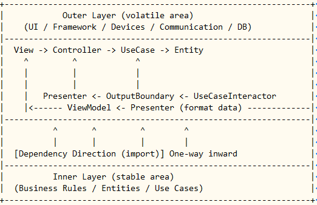

# 第6章：振り返り（理論編）

---

## 🎯 この章の目的

- ここまで実装したコードとクリーンアーキテクチャの図を照らし合わせる。  
- 「依存性の逆転」「依存方向と制御方向」「抽象と具象の関係」を整理して理解する。  
- クリーンアーキテクチャの**設計哲学**を、自分の言葉で説明できるようになる。

---

## 🧩 1. ここまでの構造をおさらい

| 層 | 例（ファイル） | 内容 |
|----|----------------|------|
| **Entity** | `domain/note.py` | ビジネスルール（変わらない核） |
| **UseCase** | `usecase/create_note.py` など | アプリケーションルール |
| **Interface Adapter** | `interface/controller.py`, `interface/presenter.py` | 入出力変換の層 |
| **Infrastructure (〈DS〉)** | `infrastructure/file_repository.py` | 技術的な具象実装 |
| **Main (Composition Root)** | `main.py` | 全層の結線・依存注入 |

---

## 🌀 2. 同心円図でもう一度確認

中心に行くほど**安定しており、変更されにくい**層です。  
外側に行くほど**技術的な要素（変化しやすい部分）**になります。

| 層 | 変化しやすさ | 目的 |
|----|---------------|------|
| Frameworks & Drivers | もっとも変わる（例：WebフレームワークやDB） | 技術を使う |
| Interface Adapters | UIやデータ変換の調整が多い | 橋渡し |
| UseCases | ビジネスロジックの流れを定義 | ルールを使う |
| Entities | ほとんど変わらない | ルールそのもの |

---

## ⚙️ 3. 依存と制御の方向を整理

| 方向 | 意味 | 例 |
|------|------|----|
| **依存方向（Dependency direction）** | `import` の向き。外側 → 内側。 | Controller → UseCase → Entity |
| **制御方向（Control flow）** | 実行時の呼び出しの向き。内側 → 外側へ戻る。 | Entity → UseCase → Presenter → View |

> 🔁 **依存は右（内）へ、制御は左（外）へ。**

つまり、「依存関係」は常に**内側を向いて固定**されていますが、  
「制御（呼び出し）」は**往復する**構造になっています。

---

## 🧠 4. 依存性の逆転（Dependency Inversion Principle）

> 「上位レベルのモジュールは下位レベルのモジュールに依存してはならない。  
> どちらも抽象に依存すべきである。」

この原則を体現しているのが、あなたが作った構造です。

| 位置 | 抽象 or 具象 | ファイル | 依存関係 |
|------|---------------|-----------|------------|
| UseCase | 抽象 | `usecase/note_repository.py` | ← Entity |
| Infrastructure（〈DS〉） | 具象 | `infrastructure/file_repository.py` | → UseCase抽象 |

これにより、  
- UseCase（内側）は外側を知らない  
- Infrastructure（外側）はUseCaseに依存できる  
- **差し替えはMainだけで完結**  

という「依存性の逆転」が実現します。

---

## 🧩 5. 抽象と具象の住み分け

| 概念 | どこに置くか | 教材での例 |
|------|---------------|-------------|
| **抽象（interface）** | UseCase層 | `NoteRepository` |
| **具象（implementation）** | Infrastructure層 | `FileNoteRepository` |
| **抽象を呼ぶコード** | UseCase層・Interface Adapter層 | `CreateNoteUseCase` |
| **具象を注入する場所** | Main（Composition Root） | `main.py` の `repo = FileNoteRepository()` |

---

## 💡 6. ViewとControllerの関係（再確認）

| 観点 | 内容 |
|------|------|
| **ViewはControllerを直接importしない** | Viewは「Controllerを使う」けれど、依存関係は抽象経由（Mainで注入）。 |
| **ControllerはViewを知らない** | 依存が逆にならないよう、ControllerはUI層を参照しない。 |
| **両者の接続はMainで行う** | これにより、Web/CLI/GUIなどViewの変更にも耐えられる。 |

---

## 🧩 7. 〈DS〉（Data Source）の意味

「<DS>」はクラス図中の **Data Source（データソース）** を表します。  
あなたが作った `FileNoteRepository` が、まさにその実装です。

| 層 | 抽象 | 具象（〈DS〉） | 依存方向 |
|----|-------|----------------|------------|
| UseCase | `NoteRepository` | （定義） | ← Entity |
| Infrastructure | `FileNoteRepository` | 〈DS〉実装 | → UseCase抽象 |

---

## 🔍 8. Mainが担う哲学的な役割

> 「誰と誰を結びつけるかは、アプリケーションの最外側で決める。」

| 概念 | 意味 | 教材での対応 |
|------|------|--------------|
| **Composition Root** | 依存注入の根っこ | `main.py` |
| **アーキテクチャ境界の接着剤** | 層を越える唯一の場所 | `build_app()` |
| **切り替え可能性の中枢** | 〈DS〉やViewを差し替える | `repo = FileNoteRepository()` |

---

## 🔄 9. 全体をひとことで言うと

> **「依存は内へ、制御は外へ」**

- 外側は内側を知ってもよいが、内側は外側を知らない。  
- 外側が変わっても内側は壊れない。  
- Mainで“つなぐだけ”で世界が動く。  
- これがクリーンアーキテクチャの力です。

---

## ✨ 10. 学びのまとめ

| 観点 | 学んだこと |
|------|-------------|
| **構造** | 同心円の層構造。内側ほど安定、外側ほど可変。 |
| **依存方向** | import はすべて内向き（右向き）。 |
| **制御方向** | 実行は左向きに戻る（往復構造）。 |
| **抽象と具象** | 抽象（UseCase）と具象（Infra）を分離し、Mainで結合。 |
| **View/Controllerの独立** | UIを自由に差し替えられる構造を確立。 |
| **〈DS〉の意味** | 技術的実装の最外層（FileNoteRepositoryなど）。 |

---

> 💬 **ここまでで「作って理解するクリーンアーキテクチャ」は完結です。**
> 
> コードを通して得た感覚をもう一度整理すれば、  
> 理論書を読んでも、どんな図を見ても「どこに何があるか」が明確にわかります。

