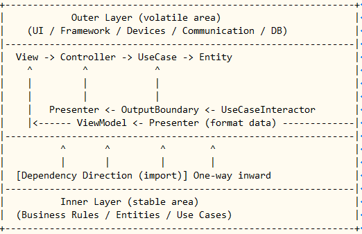

# 第５章：振り返り（理論編）

## 🎯 この章の目的

この章では、**ここまでに実装した全層の関係を理論的に整理**します。

CLI版（第1巡）・Web版（第2巡）のどちらも、同じ構造を共有しています。
違うのは「外側の技術」だけ。

クリーンアーキテクチャの本質を一言で言えば：

> **「依存は内へ、制御は外へ」**

この1行を理解できれば、すでにアーキテクトの視点に立っています。

---

## 🌀 クリーンアーキテクチャの同心円を再確認


| 層                        | 主な責務                       | 依存方向（import）         | 制御方向（実行）     |
| ------------------------ | -------------------------- | -------------------- | ------------ |
| **Entities**             | ビジネスルール（最も安定）              | なし                   | 内部ロジック       |
| **Use Cases**            | アプリケーションルール（エンティティの利用方法）   | → Entities           | ← 出力を返す      |
| **Interface Adapters**   | 外界と内界の橋渡し（変換・整形）           | → Use Cases          | ← ViewやDBへ戻す |
| **Frameworks & Drivers** | 技術的実装（UI, DB, Web, Device） | → Interface Adapters | ← 最外層から起動    |

---

## 🔁 「依存は内へ、制御は外へ」

下の図が、その関係をまとめたものです。



```
依存（import）:   外 → 内
制御（runtime）:  内 → 外
```

| 方向               | 意味                         |
| ---------------- | -------------------------- |
| **依存方向（import）** | 外側の層が内側を知っている（内側は外側を知らない）  |
| **制御方向（実行）**     | ユーザー操作などの実行は外側から入り、結果が外へ戻る |

この構造により、
外部技術が変わっても **内側は無傷で保たれる** ― これが“クリーン”な所以です。

---

## 🧩 クラス図と照らしてみる


| 区分                              | クラス図の要素                                       | 実装例（第1巡/第2巡）                                                                            | 役割                             |
| ------------------------------- | --------------------------------------------- | --------------------------------------------------------------------------------------- | ------------------------------ |
| **Entities**                    | `Note`                                        | `domain/note.py`                                                                        | ルールの心臓。保存やUIを知らない。             |
| **UseCaseInteractor**           | `CreateNoteUseCase` など                        | `usecase/create_note.py`                                                                | アプリケーション固有の動作。Entityを利用。       |
| **Data Access Interface（I）**    | `NoteRepository`                              | `usecase/contracts/note_repository.py`                                                  | 抽象契約。外部データ源を隠す。                |
| **Data Access（DS）**             | `FileNoteRepository` / `SQLiteNoteRepository` | `infrastructure/file_repository.py` / `infrastructure/sqlite/note_repository_sqlite.py` | 抽象を実装（外界の技術を担当）。               |
| **InputBoundary / InputData**   | DTO, Boundary                                 | `usecase/dto.py` / `usecase/boundaries/note_boundaries.py`                              | Controller → UseCase間のデータ契約。   |
| **OutputBoundary / OutputData** | ViewModel                                     | `interface/presenter.py`                                                                | UseCase → Presenter間の出力契約。     |
| **Controller**                  | `NoteController`                              | `interface/controller.py`                                                               | 入力変換：Viewからの操作をUseCase呼び出しに変換。 |
| **Presenter**                   | `NotePresenter`                               | `interface/presenter.py`                                                                | 出力変換：UseCase結果をViewModelに整形。   |
| **ViewModel**                   | `NoteViewModel`                               | `interface/presenter.py`                                                                | Viewが扱う最終データ形。                 |
| **View**                        | CLIView / HTML                                | `infrastructure/cli/console_view.py` / `templates/*.html`                               | 出力の最終整形。                       |
| **Web/受付**                      | ConsoleServer / FastAPI                       | `infrastructure/cli/console_server.py` / `main.py`（FastAPI）                             | 入力の最外層。                        |

---

## 🧱 第1巡・第2巡の構造比較

| 観点        | 第1巡（CLI版）         | 第2巡（Web+DB版）      |
| --------- | ----------------- | ----------------- |
| **UI**    | Console（キーボード＋画面） | Web（FastAPI＋HTML） |
| **データ保存** | InMemory／File     | SQLite（DB）        |
| **技術依存**  | ほぼ無し（標準ライブラリ）     | Web＋DBフレームワーク     |
| **構造**    | 同心円図を最小構成で体験      | 実運用に近い形へ拡張        |
| **目的**    | 図の意味を“手で感じる”      | 現実の技術を“構造の上で使う”   |

👉 構造は全く同じ。違うのは **「外側の具体技術」** だけです。
つまり、「CLI→Web」にしても、**内側（UseCase／Entity）は変更ゼロ**です。

---

## 💡 この構造がもたらすメリット

| 効果         | 内容                                         |
| ---------- | ------------------------------------------ |
| **技術の独立性** | DB, Web, UI を入れ替えても内側はそのまま。                |
| **テスト容易性** | 内側（UseCase）はモックを渡して単体テスト可能。                |
| **責務の明確化** | “誰が何を知っているか”が一目で分かる。                       |
| **再利用性**   | Entity/UseCaseはどんな外界（Web, CLI, IoT）にも再利用可。 |
| **保守性**    | 変更が外側だけで完結。内側に波及しない。                       |

---

## 🔍 学習の振り返りポイント

| 層                     | 学んだこと                         | 代表ファイル                                              |
| --------------------- | ----------------------------- | --------------------------------------------------- |
| **Entity**            | ビジネスルールだけを書く。保存や表示は一切しない。     | `domain/note.py`                                    |
| **UseCase**           | Entityを使い、アプリとして「何をできるか」を定義。  | `usecase/create_note.py`                            |
| **Interface Adapter** | 入出力の橋渡し。ControllerとPresenter。 | `interface/controller.py`, `interface/presenter.py` |
| **Infrastructure**    | 技術的な実装（DB, Web, CLI, ファイルなど）。 | `infrastructure/sqlite/*`, `infrastructure/cli/*`   |
| **Main**              | 依存注入（DI）を行い、すべての層をつなぐ。        | `main.py`                                           |

---

## ⚙️ 依存関係の全体図（CLI / Web 共通）

```
[外側] Frameworks & Drivers
 ├─ ConsoleServer / Web(HTTP)
 ├─ ConsoleView / HTML
 └─ SQLite / File / API Gateway
          ↓ import
[中間] Interface Adapters
 ├─ Controller  →  UseCase(InputBoundary)
 └─ Presenter   ←  UseCase(OutputBoundary)
          ↓ import
[内側] Use Cases
 ├─ UseCaseInteractor
 └─ Repository契約, DTO, Boundary
          ↓ import
[中心] Entities
 └─ ビジネスルール（Noteなど）
```

---

## 🔎 よくある質問（FAQ風）

| 質問                              | 回答                                                        |
| ------------------------------- | --------------------------------------------------------- |
| **「Gateway」ってどこで使うの？**          | WebAPI・外部サービス（決済や通知など）を呼ぶ層。第2巡では省略。第3巡で登場。                |
| **「ViewとController」は直接つながらない？** | はい。制御はController→UseCase→Presenter→View。依存線（import）は引かない。 |
| **「Mainって何者？」**                 | “接着剤”かつ“配線図”。すべての具体型（Infra層）をここで組み合わせる。                   |
| **「CLIでもViewやWeb層はあるの？」**       | あります。入力装置（Keyboard＝受付）、出力装置（Screen＝View）として明示。            |
| **「UseCaseの外にDB操作を書いてはいけないの？」** | ダメ。DBは外界。契約（Repository）を介してのみアクセス。                        |

---

## 🧠 最後に：構造を支える三原則

| 原則               | 内容                       |
| ---------------- | ------------------------ |
| **SRP（単一責任原則）**  | 各層は自分の仕事だけをする。           |
| **DIP（依存性逆転原則）** | 抽象（契約）に依存し、具体（技術）に依存しない。 |
| **OCP（開放閉鎖原則）**  | 新しい技術や機能は「外側を追加」するだけで対応。 |

---

## 🚀 ここまでのゴール

✅ クリーンアーキテクチャの図を「読む」だけでなく、「作って体感」できた。
✅ 同じ構造で CLI / Web の両方が動くことを確認した。
✅ 依存方向・制御方向・層の責務を、具体コードで把握できた。

> 次章では、この構造を保ったまま「外部サービス（Gateway）」や「非同期処理」を導入していきます。
> これが第3巡（応用編）のテーマです。

---

この「振り返り」までで、
**“図を見てプログラムを組める人”** の入り口に完全に立っています。
