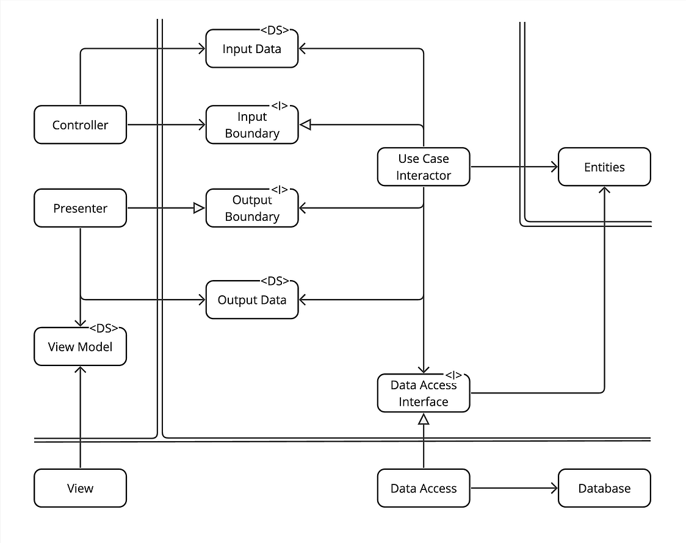

## 🤔 制御の流れと依存方向は分離しコントロールせよ

これは、ソースコード上の`import`文の向き（**依存方向**）と、プログラム実行時の処理の呼び出し順（**制御の流れ**）は、必ずしも一致しないという重要な原則です。特に、`Use Case`から`Presenter`への戻りの部分で顕著に現れます。

## 🛂 インターフェースの役割：分離の実現者

この分離を可能にする唯一の部品が**インターフェース**です。インターフェースは、`Use Case`と`Presenter`の間に立ち、両者が直接知り合うことを防ぎます。これにより、処理の呼び出し方向と、ソースコードの依存方向をねじ曲げることが可能になります。

## 🛠️ フロー図による可視化

この関係性は、詳細なフローのクラス図を見ると一目瞭然です。

この図には、2種類の矢印が存在します。
1.  **実線の矢印（→）**: **制御の流れ**。プログラム実行時に、メソッドが呼び出される方向です。
2.  **白抜きの矢印（⇨）**: **依存方向**。ソースコード上で、`import`文が向かう方向です。

`UseCase`から`Presenter`への部分に注目すると、**制御の流れ**（実線）は`UseCase`から`Presenter`に向かっていますが、**依存の矢印**（白抜き）は、`UseCase`からも`Presenter`からも、中央の`<I> Boundary`（インターフェース）に向かっていることがわかります。

## 🛠️ 題材との関連（監視レコーダー）

1.  ### **制御の流れ (Flow of Control)**
    プログラムが実行されるとき、処理は以下のように一方向に流れます。
    `View` → `Controller` → **`UseCase`(`Interactor`) → `Presenter`** → `ViewModel`
    `UseCase`は、自身の処理が終わった後、`Presenter`のメソッドを呼び出して、後処理を依頼します。これは、川の水が上流から下流に流れるような自然な流れです。

2.  #### **依存方向 (Direction of Dependency)**
    一方で、ソースコード上の依存関係（`import`文）は、この流れに逆らうような構造になっています。
    * **`Presenter`**は`boundaries.py`にある`HandleAlarmOutputBoundary`という**インターフェース**を`import`し、それを実装します。
    * **`UseCase`**は、具体的な`Presenter`クラスを**`import`しません**。代わりに、同じ`HandleAlarmOutputBoundary`という**インターフェース**を`import`し、そのインターフェースに定義されたメソッド（`present`）を呼び出します。

－－－

つまり、**制御の流れ**は`UseCase`から`Presenter`へと進むのに、**ソースコードの依存方向**は、`UseCase` → `Boundary` ← `Presenter` という形で、`Boundary`（インターフェース）を介して「逆転」しているのです。

この「依存性の逆転」によって、`UseCase`は`Presenter`の具体的な実装から完全に切り離され、独立性を保つことができます。これにより、`UseCase`をテストする際にUIのことを一切気にする必要がなくなったり、`Presenter`の実装を（例えばコンソール用からGUI用に）差し替えても`UseCase`のコードには一切変更が必要ない、という絶大なメリットが生まれるのです。

## 🤔 制御の流れと依存方向は分離しコントロールせよ、もインターフェースが重要な役割ですよね。これは依存性反転の原則とは同じなのでしょうか？

同じではありませんが、依存性反転の原則（DIP）を応用した、非常に密接に関連する原則です。

* **依存性反転の原則（DIP）**: 「具象ではなく、抽象（インターフェース）に依存せよ」という、部品（クラス）の作り方に関する**基本的なルール**です。
* **制御の流れと依存方向の分離**: DIPというルールを使い、**アーキテクチャの境界を越える際の「処理の流れ」と「ソースコードの依存関係」を意図的に食い違わせる**、より高度な**応用テクニック**です。

