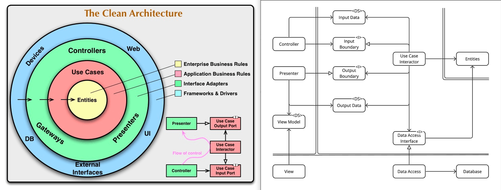

# 04 Presenter

### `interface_adapters/presenter.py`（`VendingMachinePresenter`）

---

## 🎯 役割概要

Presenter は、ユースケースの実行結果を「そのまま人に見せられる形」に変換し、View（画面表示担当）が参照できる状態として保持するコンポーネントです。

より具体的には、Presenter は次の2点を行います。

1. 🧾 ユースケースから渡された**生の結果（ドメイン寄りの情報）**を受け取る
   例：「商品名＝お茶」「お釣り＝40円」「現在の投入金額＝200円」「エラーメッセージ＝お金が足りません」など

2. 🗣 それらを**ユーザーに見せる文章**に整形し、View が読み取れる場所（ViewModel）に保持する
   例：「『お茶』が出てきました。お釣りは40円です。」
   「現在の投入金額: 200円」
   「エラー: お金が足りません。」

重要なのは、Presenter 自身は画面に表示しません。
Presenter はあくまで「表示用データを準備する担当者」であり、実際にそれをユーザーに提示するのは View の責務です。



## 📂 ファイルの配置

この教材では、Presenter は `interface_adapters/` 層に配置します。
この層は「内側の結果」と「外側の入出力（UIやハードウェア）」を橋渡しする役割を持ちます。

```text
vending_machine/
├─ domain/
│   ├─ entities.py              # Item, PaymentManager など（ビジネスルールの中心）
│   └─ errors.py                # ドメイン例外
│
├─ usecase/
│   ├─ dto.py                   # InputData / OutputData / ViewModel
│   ├─ boundaries.py            # UseCaseが利用するインターフェース群
│   ├─ select_item_usecase.py   # 商品購入ユースケース
│   └─ insert_coin_usecase.py   # コイン投入ユースケース
│
├─ interface_adapters/
│   ├─ presenter.py             # ← 本章で説明する Presenter
│   ├─ controller.py            # Controller（ユーザー操作→UseCase呼び出し）
│   ├─ view_console.py          # View（CLI表示）
│   ├─ data_access.py           # 在庫取得・更新の具体実装（インメモリ）
│   └─ hardware_adapter.py      # ハードウェア操作の具体実装（コンソールで模擬）
│
└─ main.py                      # 依存をまとめて接続し、アプリを起動する
```

📌 Presenter は `usecase/` ではなく `interface_adapters/` に置きます。
理由は後述しますが、Presenter は「ユースケースの外側の詳細（表示形式や文言表現）」に強く影響されるため、ビジネスロジック本体からは分離します。

---

## 🔄 Presenter が関わるデータの流れ

ユースケース（アプリケーションロジック）は、結果を「OutputData」として Presenter に渡します。

Presenter はそれを「ViewModel」という形で保持します。

View は ViewModel を読み取って、画面やコンソール出力としてユーザーに見せます。

フローは次のようになります。

1. UseCase
   → 「業務的な結果」を OutputData として Presenter に渡す
2. Presenter
   → OutputData を読み取り、ユーザーに伝えるためのメッセージを組み立てる
   → ViewModel（表示用データ置き場）を更新する
3. View
   → ViewModel の内容をそのまま表示する

---

## 💻 コード例：Presenter（正式版）

以下は、コイン投入や商品購入といったユースケースからの結果を受け取り、ViewModel を更新する Presenter の例です。

```python
# -----------------------------------------------------------------------------
# File: interface_adapters/presenter.py
# Layer: Interface Adapters（表示用の整形と保持）
#
# 目的:
#   - ユースケースの結果（業務的な事実）を受け取り、
#     そのまま人に見せられるメッセージに整形する。
#   - そのメッセージを ViewModel に保持し、View が参照できるようにする。
#
# 重要:
#   - Presenter は「表示用の文章を組み立てる」が、「print」はしない。
#   - 画面への実際の出力は View 側が行う。
# -----------------------------------------------------------------------------

from vending_machine.usecase.dto import (
    InsertCoinOutputData,
    SelectItemOutputData,
    VendingMachineViewModel,
)
from vending_machine.usecase.boundaries import VendingMachineOutputBoundary


class VendingMachinePresenter(VendingMachineOutputBoundary):
    """
    ユースケースの結果をユーザー向けの表示テキストに変換し、
    ViewModel に格納する Presenter。

    - ユースケース（内側）から呼び出される。
    - View（最外側）から参照される。
    - その間の「翻訳係」「メッセージ整形係」にあたる。
    """

    def __init__(self):
        # View に共有される「最新の表示用データ」
        # View はこの view_model を読んで画面を描画する。
        #
        # ※ 初期メッセージをセットしておくことで、
        #   アプリ起動直後に案内文を表示できる。
        self.view_model = VendingMachineViewModel(
            last_message="自動販売機へようこそ。コインを投入してください。",
            current_amount=0,
        )

    # -----------------------------------------------------------------
    # コイン投入結果の表示更新
    # -----------------------------------------------------------------
    def present_insert_coin_result(self, output_data: InsertCoinOutputData) -> None:
        """
        コイン投入ユースケースから呼ばれる。
        例: 100円を投入した、現在の合計は200円、など。

        output_data:
            - inserted_amount: 今回投入した金額 (例: 100)
            - total_amount: 現在の投入合計 (例: 200)
        """

        # ユーザーにそのまま見せたい文面をここで整形する
        message_text = f"{output_data.inserted_amount}円を投入しました。現在の投入金額: {output_data.total_amount}円"

        # ViewModel を更新する
        self.view_model = VendingMachineViewModel(
            last_message=message_text,
            current_amount=output_data.total_amount,
        )

    # -----------------------------------------------------------------
    # 商品選択結果の表示更新
    # -----------------------------------------------------------------
    def present_select_item_result(self, output_data: SelectItemOutputData) -> None:
        """
        商品選択ユースケースから呼ばれる。
        商品が購入できたか / エラーだったか を含む結果を整形する。

        output_data:
            - success: 成功したかどうか (bool)
            - item_name: 商品名 (例: "お茶")
            - change: おつりの金額 (例: 40)
            - remaining_amount: 残りの投入金額（購入後にまだ残っているお金）
            - error_message: エラーメッセージ（失敗時のみ）
        """

        if output_data.success:
            # 正常に購入できた場合のユーザー向けメッセージ
            # 例: 「『お茶』が出てきました。お釣りは40円です。」
            message_text = (
                f"「{output_data.item_name}」が出てきました。"
                f"お釣りは{output_data.change}円です。"
            )
        else:
            # 失敗した場合（例: 残高不足、売り切れなど）
            # 例: 「エラー: お金が足りません。」
            message_text = f"エラー: {output_data.error_message}"

        # ViewModel を更新する
        self.view_model = VendingMachineViewModel(
            last_message=message_text,
            current_amount=output_data.remaining_amount,
        )

    # -----------------------------------------------------------------
    # View 側から、最新の状態を参照するためのヘルパ
    # -----------------------------------------------------------------
    def get_view_model(self) -> VendingMachineViewModel:
        """
        View（画面側）が現在の表示内容を取得するためのアクセサ。
        View はこの戻り値をそのまま出力すればよい。
        """
        return self.view_model
```

---

## 🧩 関連する DTO / ViewModel のイメージ

Presenter が扱うデータ型（DTOとViewModel）は `usecase/dto.py` に定義されている想定です。
ここでは参考として、そのイメージを簡単に示します。

```python
# vending_machine/usecase/dto.py

from typing import NamedTuple


class InsertCoinOutputData(NamedTuple):
    inserted_amount: int      # 今回投入した金額（例: 100）
    total_amount: int         # 現時点での合計投入金額（例: 200）


class SelectItemOutputData(NamedTuple):
    success: bool             # 購入に成功したか
    item_name: str | None     # 商品名（成功時のみ有効）
    change: int               # お釣り
    remaining_amount: int     # 残っている投入金額
    error_message: str | None # エラー内容（失敗時のみ）


class VendingMachineViewModel(NamedTuple):
    last_message: str         # 画面に表示すべきメッセージ
    current_amount: int       # 現在保持している投入金額
```

📝 重要な観点：

* `InsertCoinOutputData` や `SelectItemOutputData` は「ユースケースが返す事実」
  例：「成功か」「お釣りはいくらか」「残高はいくらか」

* `VendingMachineViewModel` は「ユーザーに提示する最終的な形」
  例：「お釣りは40円です。」という文章全体

Presenter の役割は、この「事実」→「提示用の文面」の翻訳です。

---

## 🔍 Presenter がやるべきこと / やってはいけないこと

### ✅ Presenter がやるべきこと

* 数値や状態を、人間が読んで理解できるメッセージにする
* 定型文や敬語など、文言ポリシーを中央集約する
* ViewModel に値を反映させる

### ❌ Presenter がやってはいけないこと

* 直接 `print()` するなど、画面に出力してしまう
  → それは View の責務です

* ビジネスロジックを判断する
  （たとえば「残高が足りない場合は購入失敗にする」などのルール）
  → それは UseCase の責務です

* 在庫やお金の状態を操作する
  → それは UseCase やドメイン（`PaymentManager` / `Item`）の責務です

Presenter は「表示用の整形」と「ViewModel への反映」に専念します。

---

## 🧪 テストの観点

Presenter は副作用が小さいため、単体テストしやすい層です。
やるべきことは「特定の OutputData を渡したら、ViewModel が期待どおりの内容になるか？」だけです。

簡単なイメージを示します。

```python
def test_presenter_正常購入メッセージ():
    presenter = VendingMachinePresenter()

    output = SelectItemOutputData(
        success=True,
        item_name="お茶",
        change=40,
        remaining_amount=0,
        error_message=None,
    )

    presenter.present_select_item_result(output)
    vm = presenter.get_view_model()

    assert "お釣りは40円です" in vm.last_message
    assert vm.current_amount == 0


def test_presenter_エラーメッセージ():
    presenter = VendingMachinePresenter()

    output = SelectItemOutputData(
        success=False,
        item_name=None,
        change=0,
        remaining_amount=200,
        error_message="お金が足りません。",
    )

    presenter.present_select_item_result(output)
    vm = presenter.get_view_model()

    assert vm.last_message == "エラー: お金が足りません。"
    assert vm.current_amount == 200
```

このテストでは、DBもハードウェアもViewも一切不要です。
Presenter 単体での検証が可能です。これは「UIの見せ方」と「ビジネスロジック」を分離した効果です。

---

## 🔍 なぜ Presenter は usecase/ ではなく interface_adapters/ にあるのか？

これはよく質問される点なので、整理しておきます。

* ユースケース層は「ビジネスロジックの流れ」を定義する場所です。
  ここでは「どの条件で売るか」「いくらお釣りを返すか」といった意思決定が行われます。

* それに対して Presenter は、「どのような文言・形式でユーザーに伝えるか」を決める場所です。
  これは業務ルールの本質ではなく、**表示仕様（UI仕様）**です。

表示仕様はしばしば変更されます。
敬語の方針が変わる、メッセージに絵文字を入れる、エラーは赤字にする、などは典型的な変更点です。

そのため Presenter は、変わりやすい「外側の都合」に属するコンポーネントとみなし、`interface_adapters/` に置きます。

---

## 🛡 まとめ（この層の原則）

> 🎯 Presenter は「翻訳係」であり「表示用データの管理係」である。
> ビジネスルールは決めない。画面にも直接出さない。

* UseCase は、ビジネスとして何が起きたかを OutputData にまとめる
* Presenter は、その結果を人間に伝える文章にする
* View は、その文章をユーザーに提示する

この分業によって、それぞれの層が明確な責務を持ち、どの層もテストしやすくなります。
さらに、UIの変更・文言の調整・表示媒体の差し替え（CLI・GUI・Web・組み込み端末）が容易になります。
