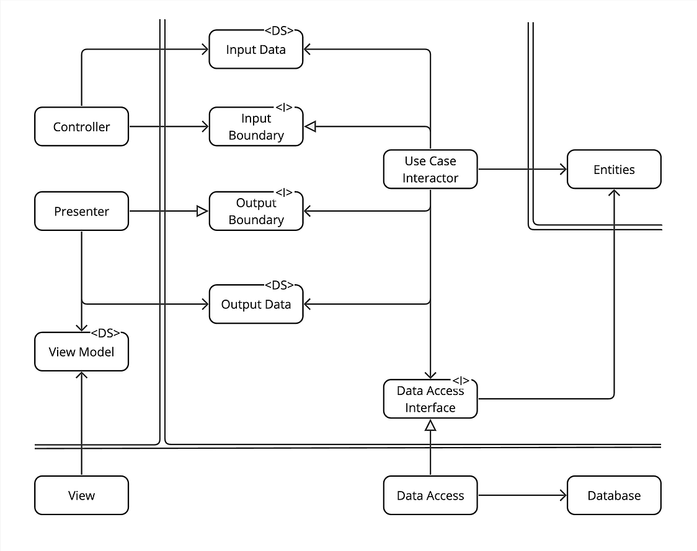
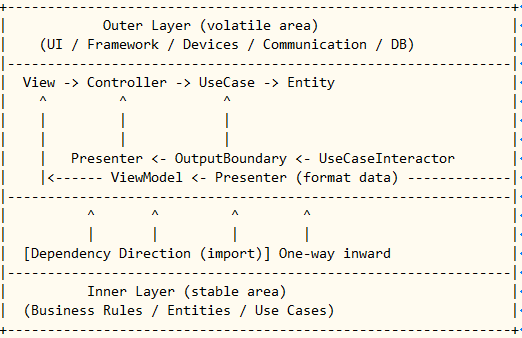

# 第7章：ViewとControllerの関係



---

## 🎯 この章の目的

- 「View」と「Controller」の関係を、**依存と制御の両面**から理解する。  
- クリーンアーキテクチャの図に「View→Controller」の線がない理由を整理する。  
- コード上で両者がどのように接続されているかを再確認する。

---

## 🧩 1. ViewとControllerの位置づけ

| 要素 | 層 | 主な責務 |
|------|----|-----------|
| **View** | Frameworks & Drivers（最外層） | ユーザー入力を受け取り、表示を行う。 |
| **Controller** | Interface Adapter層 | Viewの入力を解釈し、UseCaseを呼び出す。 |

両者は隣り合っており、制御の流れとしては「View→Controller→UseCase」となります。

しかし、**依存関係（importの方向）**としては、  
「View → Controller」ではなく **Mainで依存注入される関係** になります。

---

## 🧠 2. 制御と依存の関係を区別しよう



| 種別 | 説明 | 向き |
|------|------|------|
| **制御（Control Flow）** | 実行時の呼び出しの流れ。<br>ViewがControllerを呼び出す。 | 左 → 右（View→Controller） |
| **依存（Dependency / import）** | ソースコード上の参照関係。<br>ViewはControllerをimportしない。 | 右 → 左（外→内） |

つまり、「実行上は呼んでいるが、コード上は依存していない」。  
この構造を可能にするのが**依存注入（Dependency Injection）**です。

---

## ⚙️ 3. 依存注入（DI）の実例

教材の `main.py` でのこの部分が、それを実現しています。

```python
controller = NoteController(create_uc, get_all_uc)
presenter = NotePresenter()
view = CLIView(controller, presenter)
````

* `CLIView`（View）は自分でControllerをimportしていません。
* `main.py`（Composition Root）が両者を「つないで」います。
* 実行時はView→Controller→UseCaseと動きますが、
  **Viewコード内に「from interface.controller import ...」は存在しません。**

---

## 🧩 4. 図に線がない理由

本のクラス図に「View→Controller」の線が描かれていない理由は、
**依存関係が存在しない**からです。

| 方向             | 意味                 | 有無   | 説明            |
| -------------- | ------------------ | ---- | ------------- |
| **制御（呼び出し）**   | ViewがControllerを呼ぶ | ✅ ある | 実行時には呼び出している  |
| **依存（import）** | ViewがControllerを参照 | ❌ ない | Mainでつながるため不要 |

> ✅ **制御はあるが依存はない**
> → 図に線が引かれない理由は「import関係が存在しない」から。

---

## 💡 5. ViewがControllerを“知っている”仕組み

では、ViewがControllerをどうやって使えるのでしょうか？

答えは **「コンストラクタで受け取る」** です。

```python
class CLIView:
    def __init__(self, controller: NoteController, presenter: NotePresenter):
        self.controller = controller
        self.presenter = presenter
```

ViewはControllerを直接importせずに、**インスタンスとして注入**されます。
これにより依存方向（import）は守られたまま、実行時の制御だけが確立されます。

---

## 🔁 6. 抽象の役割

もし、ViewとControllerを完全に分離して複数View（CLI、Web、GUIなど）を共存させたい場合、
Controllerの**抽象インターフェース**を導入する方法もあります。

```python
from abc import ABC, abstractmethod

class INoteController(ABC):
    @abstractmethod
    def create(self, title: str, content: str): ...
    @abstractmethod
    def list_all(self): ...
```

* Viewは `INoteController` に依存する（import可）
* 実際の `NoteController` はそのインターフェースを実装する
* 依存方向は内向きのまま（View → Interface）

> ただし、これは長期的・複数UI対応の大規模システムで必要。
> 小規模な教材レベルでは **Mainでの依存注入で十分** です。

---

## 📘 7. ViewとControllerの関係まとめ

| 観点             | 内容                                     |
| -------------- | -------------------------------------- |
| **制御方向**       | View → Controller（呼び出しの流れ）             |
| **依存方向**       | Controller ← View（Mainで注入）             |
| **線がない理由**     | 依存（import）が存在しないため                     |
| **結線の場所**      | Main（Composition Root）                 |
| **抽象導入のタイミング** | 複数Viewを想定する場合のみ                        |
| **目的**         | ViewとControllerの疎結合（Viewを自由に差し替え可能にする） |

---

## 💬 8. 一言でまとめると

> **ViewはControllerを“呼ぶ”が、“依存しない”。**
>
> ControllerはViewを知らず、両者の接続はMain（Composition Root）が担う。
>
> 図に線がないのは、「import関係が存在しない」ため。

---

## 🧭 9. さらに理解を深めたい人へ（発展）

* MVC（Model-View-Controller）との比較
  → クリーンアーキテクチャのControllerは「ユースケース呼び出し層」であり、MVCのControllerとは異なる責務。
* 抽象化を強化した構成（`INoteController` / `IView` の導入）
* Event-driven構造やDIコンテナ導入の発展

---

## ✅ 10. まとめ

| キーワード      | 一言で                        |
| ---------- | -------------------------- |
| **制御**     | View → Controller（イベントを渡す） |
| **依存**     | Controller ←（Main経由で注入）    |
| **線がない理由** | import関係がないから              |
| **接続の場所**  | Main（Composition Root）     |
| **学びの核**   | 「呼び出しても、依存しない」構造           |

---

> 💡 **クリーンアーキテクチャにおけるViewとControllerの関係は、
> “依存しない制御”という設計の美しさを象徴しています。**

