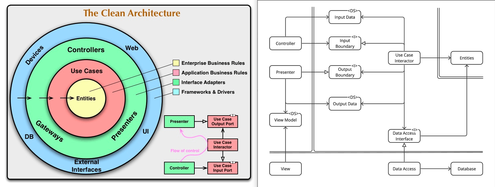

# 08：補足

## 🤔 UseCase 内の contracts の 3つ reservation_repository.py 、room_repository.py、member_repository.py は Entityの３つを保存するものであるので、常にEntity内のクラスと同じ数が必要になるということでいいでしょうか？


結論からいうと：

> ✅ **「Entityの数」と「Repositoryの数」は必ずしも1対1ではありません。**
> しかし、**多くの場合は一致しやすい**です。
> （つまり、**原則は1対1だが、例外もある**ということです）

---

## 🔹 なぜ多くの場合は 1 対 1 になるのか？

Repository（リポジトリ）は

> 「ある種類のエンティティ（＝集合）を保存・取り出すための“入り口”」

だからです。

たとえば：

| Entity        | Repository（契約）          | 主な役割         |
| ------------- | ----------------------- | ------------ |
| `Room`        | `RoomRepository`        | 会議室の一覧・検索・取得 |
| `Member`      | `MemberRepository`      | 会員の登録・検索     |
| `Reservation` | `ReservationRepository` | 予約の保存・検索・削除  |

つまり「**そのEntityをまとめて扱う単位**」で Repository を作るため、
自然と1対1になります。

---

## 🔹 でも、必ずしも1対1ではない理由

現実のドメインでは、「保存単位」がEntityと完全に一致しないことがあるためです。

### 🧩 例1：複数のEntityをまとめて扱うRepository

たとえば「予約履歴」を保存する場合：

* `Reservation`（予約）
* `Member`（予約者）
* `Room`（部屋）
  これらを**同時に扱うクエリ**（JOINなど）を行うこともあります。

その場合、
`ReservationRepository` の内部で `Member` や `Room` も一緒に扱うことになります。

→ でもあくまで「主要な責務」が `Reservation` にあるなら、
　**Repositoryは1つ**でOKです。

---

### 🧩 例2：Entityはあるが、永続化しないもの

たとえば「時間帯の計算」や「料金プラン」などのEntityが
一時的にメモリ上でしか使われない場合。
その場合は保存の必要がないので **Repositoryは不要** です。

---

### 🧩 例3：同じEntityに複数の保存手段を持たせる

たとえば `Reservation` を

* SQLiteに保存する
* CSVに書き出す
* メモリ上にキャッシュする

といった複数の保存先を使う場合、
**Repository契約は1つ**ですが、
**実装（Gateway）は複数**できます。

| 層                 | ファイル                            | 内容       |
| ----------------- | ------------------------------- | -------- |
| UseCase層          | `reservation_repository.py`     | 契約（抽象）   |
| InterfaceAdapter層 | `reservation_gateway_sqlite.py` | SQLite実装 |
| InterfaceAdapter層 | `reservation_gateway_memory.py` | メモリ実装    |
| InterfaceAdapter層 | `reservation_gateway_csv.py`    | CSV実装    |

---

## 🔹 まとめ：判断基準表

| 判断基準              | Repositoryを作る？   | 備考              |
| ----------------- | ---------------- | --------------- |
| EntityをDBなどに保存する  | ✅ 作る             | 多くのケースで1対1      |
| Entityを外部ストレージに出す | ✅ 作る             | ログやエクスポートも含む    |
| Entityが一時的（保存しない） | ❌ 作らない           | 計算・補助ロジックだけなら不要 |
| 複数Entityをまとめて扱う   | ⚙️ 必要に応じて1つにまとめる | JOINや集計系        |
| 同じEntityを複数の方法で保存 | ✅ 契約1つ、実装を複数     | Gatewayで分岐可能    |

---

## 🔸 本巡（会議室予約アプリ）の場合

| Entity        | Repository（契約） | 理由                 |
| ------------- | -------------- | ------------------ |
| `Reservation` | ✅ 必須           | 予約の保存・取得・重複チェックに使う |
| `Room`        | ✅ 必須           | 検索・定員取得・設備条件などに使う  |
| `Member`      | ✅ 必須           | 会員確認・登録に使う         |

→ 今回は**典型的な1対1対応のパターン**です。
これでクリーンアーキテクチャの「構造の王道」が体験できます。

---

### 💡 補足：設計の目印

> Repositoryは「**このEntityの集合（リスト）をどう扱うか**」が主題。
> Entityは「**1つのビジネスルール**」が主題。

です。
つまり「**単数のEntityと複数のRepository**」が逆転しないように意識すればOKです。

---
## 🤔 `ReservationRepository` の中で行っている **重複チェック(find_overlaps)** や**冪等性チェック(check_idempotency)** が「なぜUseCaseに含まれないのか？」

## 🛠️ 図解：役割の切り分け



## 1) 同心円図の視点（依存は内へ）

```
[ Frameworks & Drivers ]     ← DB・SQL・トランザクション・インデックス
           ↑
[ Interface Adapters ]       ← Gateway（Entity↔行データ変換、DBクエリ呼び出し）
           ↑
[ Use Cases ]                ← 手続きの中心（やることの順番を決める）
           ↑
[ Entities ]                 ← 純粋なルール（時間の重なり関数など）
```

* **UseCase（やることの順番）**は、**「重複があるか？」を知りたいだけ**。
  → データを**どう探すか**（SQL・インデックス）は**外側**の仕事。
* **Repository（保存の約束）**は、「**どうやって探すか**」を引き受ける窓口。
  → 実装は Gateway（IA）→ DataAccess（Infra）→ DB。

> つまり **「重複があるか？」という問いはUseCaseにあり、
> その問いに**効率よく答える実務（SQL・ロック・ユニーク制約）は外側**にある。**

---

## 2) クラス図／責務の線引き

```
Controller ──> InputBoundary ──> UseCaseInteractor
                                   │
                           (問い)  │ find_overlaps(room, start, end)  ← Repository契約（I）
                                   ▼
                          OutputBoundary <── Presenter
```

* **UseCaseInteractor**：

  * 手順：「開始<終了」→「会議室在庫」→**「重複ある？」**→「なければ採番・保存」→出力
  * **DBは知らない**。**聞く相手（契約）**だけ知っている。
* **Repository契約（UseCase層）**：

  * **質問の形**を定義：「重複を返して」「この鍵で作成済みならIDを返して」
  * まだ**SQLもDB種別も書かない**。
* **Gateway/DataAccess（外側）**：

  * 実際の**SQL・トランザクション・インデックス**を使って**早く・正確に答える**。

---

## 🛠️ 具体シナリオで比較

## A. 重複チェック（find_overlaps）

### ❌ UseCaseにDB検索を書いてしまうと…

* `SELECT ... WHERE room_id=? AND start<end AND ...` といった**SQL知識**がUseCaseに混入
* DB切替（SQLite→PostgreSQL）や高速化（インデックス）のたびに**UseCaseを変更**＝**内側が外側に引きずられる**
* テストが重くなる（毎回DB必要）

### ✅ Repositoryに任せると…

* UseCaseは**「重複があるか？」という問い**に集中できる
* 実装はGatewayで**効率的なクエリ**を選べる（期間インデックス、分割テーブルなど）
* テストはFakeRepoで**メモリ**完結、**DB不要** → 速い＆壊れにくい

> **重要**：時間重複の**判定ロジック**（`overlaps(a,b)`）はEntity（内側）に置き、
> **重複候補の検索**（N件をどう取得するか）は**Repository（外側）**に置く。
> 内側＝**何が重複か**、外側＝**どう探すか**。

---

## B. 冪等性チェック（check_idempotency）

### ❌ UseCaseが自分で“連打対策の保存状態”を持つと…

* プロセス再起動や分散構成で**状態が飛ぶ／二重登録**のリスク
* どのノードでも一意に**「同じ操作か？」**を判定できない

### ✅ Repositoryに任せると…

* **DBのユニーク制約**や**専用テーブル**（`idempotency_key -> reservation_id`）で**一意制御**できる
* トランザクションの中で

  * ①「鍵の存在確認（なければinsert）」
  * ②「予約作成」
    を**原子的**に行える（※DBによりUPSERT/ロックで実現）

> UseCaseは「鍵があれば**同じ結果を返す**」という**振る舞い**を保証し、
> そのための**記録・一意化の手段**はRepository（外側）に実装させる。

---

## 🛠️ シーケンス図（簡易）

### 予約作成（連打も想定）

```
Web(受付)
  ↓
Controller（入力を箱に）
  ↓
UseCase ── validate_time_order()
  │
  ├─ rooms.find_by_id()         ← Repository契約：会議室存在・定員確認
  │
  ├─ members.find_by_id()       ← Repository契約：会員確認
  │
  ├─ reservations.check_idempotency(key?)   ← ★ 既存結果があればIDを返す（DBで一意）
  │        └─ [Gateway→DB: UNIQUE(key)]
  │
  ├─ reservations.find_overlaps(room, start, end) ← ★ 衝突候補をDBで効率検索
  │        └─ [Gateway→DB: 範囲検索＋index]
  │
  └─ reservations.save(new)     ← 採番→保存（Tx内）
        └─ [Gateway→DB: INSERT/COMMIT]
  ↓
Presenter（ViewModel化）
  ↓
View（HTML/JSON）
```

* **星印（★）**が「なぜRepository側に置くか」の要所（DBの能力＝外側の関心）。

---

## 🛠️ 設計の原則に照らすと

* **依存性逆転（DIP）**：
  UseCaseは**外の技術**（SQL・トランザクション・ロック方式）を知らない。
  **質問の形（契約）**だけを定め、具体手段は外へ。
* **単一責任**：
  UseCaseは**手続きの正しさ**と**順番**だけ。
  Repositoryは**データの出し入れ・高速検索・一意制御**。
* **テスト容易性**：
  UseCaseは**FakeRepo**で即テスト可能。
  外の最適化（インデックス追加等）は**Gateway/DataAccess**を差し替えても
  **UseCaseのテストは不変**。

---

## 🛠️ よくある質問（FAQ）

**Q1. UseCaseが全件取得して `overlaps()` を回すのはダメ？**
A. 小規模検証なら可。ただし本番では**O(N)** でスケールせず、
**DBの範囲検索＋インデックス**が必要。だから**検索はRepository**へ。

**Q2. 冪等性はメモリの辞書で十分？**
A. 単一プロセスのデモなら可。本番では**再起動・複数ノード**で壊れるため、
**DBの一意制約 or 分散KVS**等の**永続・共有ストア**が必要。
ゆえに**Repository**で扱う。

**Q3. 「契約はUseCaseに置く／実装は外に置く」はどこまで？**
A. **UseCaseには“質問の形”だけ**（パラメータと戻り値）。
**実装の都合（SQL/索引/Tx/ロック）は一切入れない**。

---

## 🛠️ まとめ（判断の基準）

* **「何が重複か」の定義**（時間帯の数学的定義）＝**Entity/UseCase（内側）**
* **「どう早く正確に見つけるか」**（SQL・インデックス・Tx）＝**Repository/Gateway/DB（外側）**
* **冪等性の“振る舞い”の約束**＝UseCase
* **冪等性の“記録と一意化”の手段**＝Repository実装

> これで、**内側はルールに集中**、**外側は技術最適化に集中**。
> 変更や拡張に**強い構造**になります。

必要でしたら、次に **`ReservationRepository` の契約を満たすSQLite実装例（範囲検索SQL・UPSERT・Tx）** を、図対応コメントつきで提示します。

